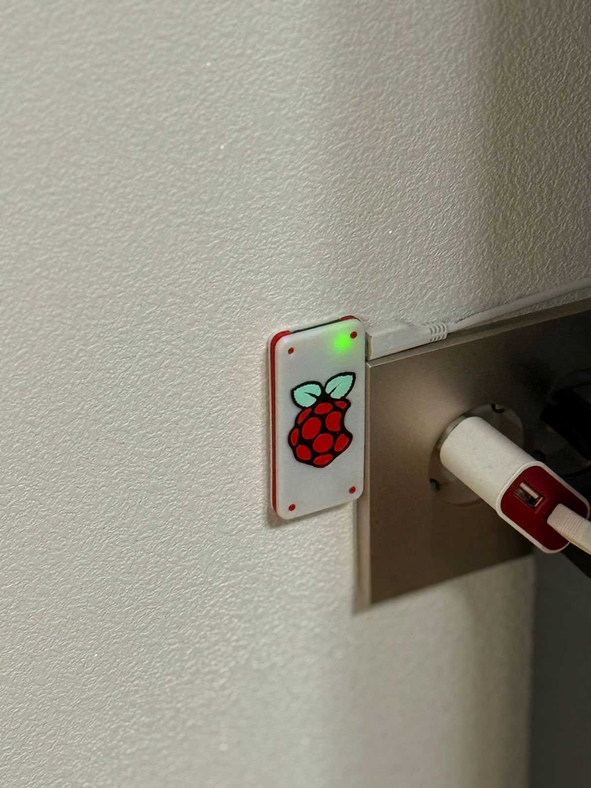

<p align="center">


&nbsp;


</p>

<span align="center">

# Homebridge Hillstate IOT Plugin

</span>

---

This is a custom plug-in that connects with the Hillstate API and enables Apple Home and **Siri** to control Lights, Heaters and ACs with minimal lag in Hillstate GwanggyoJungangyeok. I have tested this on a Raspberry PI Zero W2.

This also automatically turns off one of your AC/Heater in a room if both are on at the same time, to save power.

<span align="center">

***This lets Siri control your appliances!***

</span>


## Installation Guide

1. Install `nvm` on your PC, and then install `npm` and `node` through `nvm`
   ```
   curl -o- https://raw.githubusercontent.com/nvm-sh/nvm/v0.40.3/install.sh | bash
   export NVM_DIR="$([ -z "${XDG_CONFIG_HOME-}" ] && printf %s "${HOME}/.nvm" || printf %s "${XDG_CONFIG_HOME}/nvm")"
   [ -s "$NVM_DIR/nvm.sh" ] && \. "$NVM_DIR/nvm.sh" # This loads nvm
   nvm install lts
   ```
2. Clone this github repo
   ```
   git clone https://github.com/AkashCherukuri/Hillstate-Homebridge
   cd Hillstate-Homebridge
   ```
3. Run the following commands to build the plugin
   ```
   npm install
   npm run build
   ```

4. Power your Raspberry Pi and follow the [official guide](https://github.com/homebridge/homebridge/wiki/Install-Homebridge-on-Debian-or-Ubuntu-Linux) to install Homebridge on it

5. Copy the build files over to your raspberry pi
   ```
   rsync -av --exclude={'node_modules','.github','.git','src','test'} . pi@homebridge.local:~/work/hillstate-homebridge/
   ```

6. Connect to your raspberry pi, install only required packages and link it with homebridge
   ```
   <on your raspberry pi>
   npm install --only=production
   sudo hb-service link
   ```

7. On your PC, open `homebridge.local` in your browser and login. You should be able to see the *Hillstate IOT Plugin* in the plugins tab. Click on plugin config, edit the config accordingly and then install it!

| **Field**                       | **Value**                                                                                                                                                    |
|---------------------------------|--------------------------------------------------------------------------------------------------------------------------------------------------------------|
| Hillstate IOT username          | The username set when you registered with Hillstate IOT. This is the username used with [HT Home Service](https://www2.hthomeservice.com/login)              |
| Hillstate IOT password          | The password corresponding to the above username                                                                                                             |
| Hillstate Dong number           | Your Dong number, 101 for everyone at the time of writing                                                                                                    |
| Hillstate Ho number             | Your apartment number. Can't help you if you don't know where live.                                                                                          |
| Bathroom Vent name on Hillstate | Optional. The name of the "light" on [HT Home Service](https://www2.hthomeservice.com/login) that corresponds to your bathroom ventilation. Purely cosmetic. |

## Case

`raspberry_pi_zero_w2_case.3mf` is a case that I have remixed and printed. 



## Limitations

- Heater/AC in a single room are controlled by a unified Thermostat to reduce redundancy. The `AUTO` setting in thermostat doesn't correspond to anything and just throws an error.